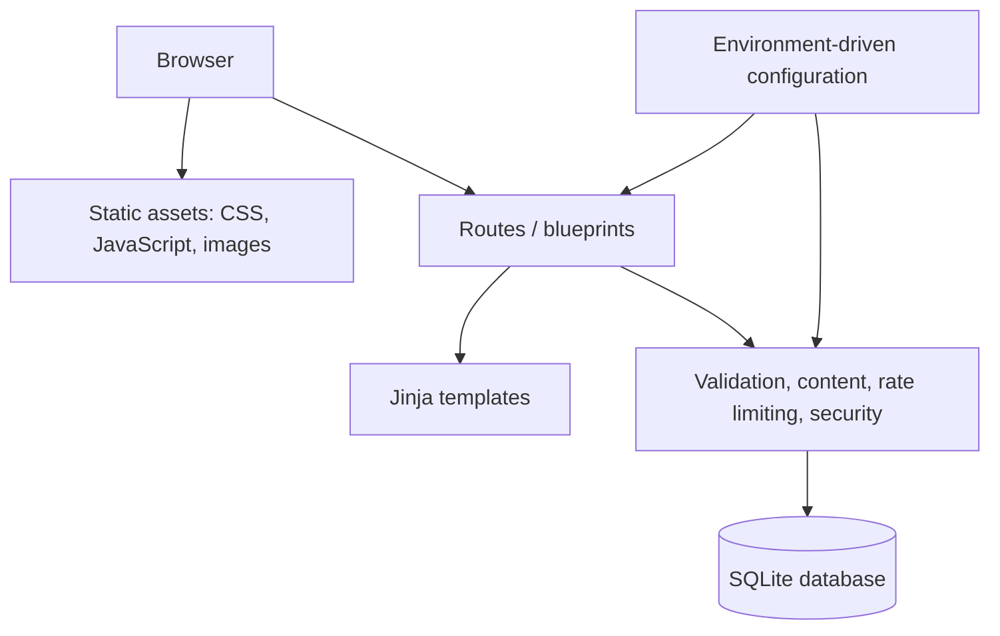
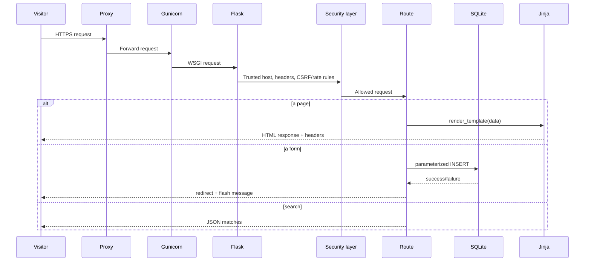
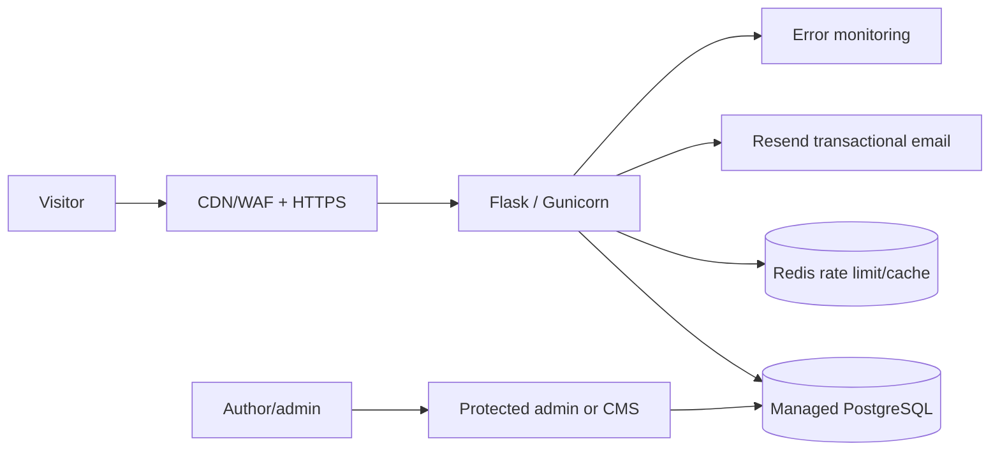

# Architecture

## Architecture in plain English

This is a conventional Flask monolith: one Python web application owns pages, form processing, search, security controls, and a small database. This is an appropriate architecture for an early editorial website because it is simple to understand and deploy. It becomes less suitable when traffic, editorial workflow, staff access, or lead volume grows.

## Application layers

| Layer | Files | Responsibility | Score |
|---|---|---:|---:|
| Entry points | `app.py`, `wsgi.py`, `Procfile` | Local and hosted startup | 7/10 |
| App composition | `lexnush/__init__.py` | Factory, extensions, CLI, blueprints | 8/10 |
| HTTP behaviour | `lexnush/routes.py` | Routes, templates, forms, SEO files | 7/10 |
| Domain helpers | `validators.py`, `security.py`, `rate_limit.py` | Input rules and abuse controls | 7/10 |
| Persistence | `db.py` | SQLite schema, backups, personal-data purge | 6/10 |
| Presentation | `templates/`, `static/` | Server HTML and browser behaviour | 8/10 |
| Tests | `tests/test_app.py` | Basic regression coverage | 6/10 |

## Request lifecycle

## Blueprints

Blueprints are Flask’s way to group routes. `main` serves pages and forms. `api` serves the search endpoint. This keeps the route namespace understandable without creating several separate services.

## Configuration model

Configuration is selected from environment variables. `DevelopmentConfig` is forgiving for local work. `ProductionConfig` turns on HTTPS-oriented cookies and refuses to start with the default secret or no trusted host list. This is good defensive design.

The current app derives external URLs from the incoming request. In production, `LEXNUSH_TRUSTED_HOSTS` must therefore contain only the real domain names. A future improvement is a single explicit public/base URL configuration for canonical URLs and sitemap output.

## Important architecture limitations

1. Content is Python data, not a CMS or database. Every new article needs a code deployment.
2. SQLite is local-file storage. It requires a durable disk, controlled backups, and a one-instance deployment until the limiter is moved away from SQLite.
3. The rate limiter writes to SQLite for search and form requests. It protects against basic abuse but can become a lock/contention point with many workers.
4. There is no authenticated staff area, outbound email service, event logging platform, or error monitoring service.

## Recommended target architecture

Do not build all of this immediately. The practical first production step is managed PostgreSQL, Resend notification, backups, monitoring, and a small secured admin workflow.
