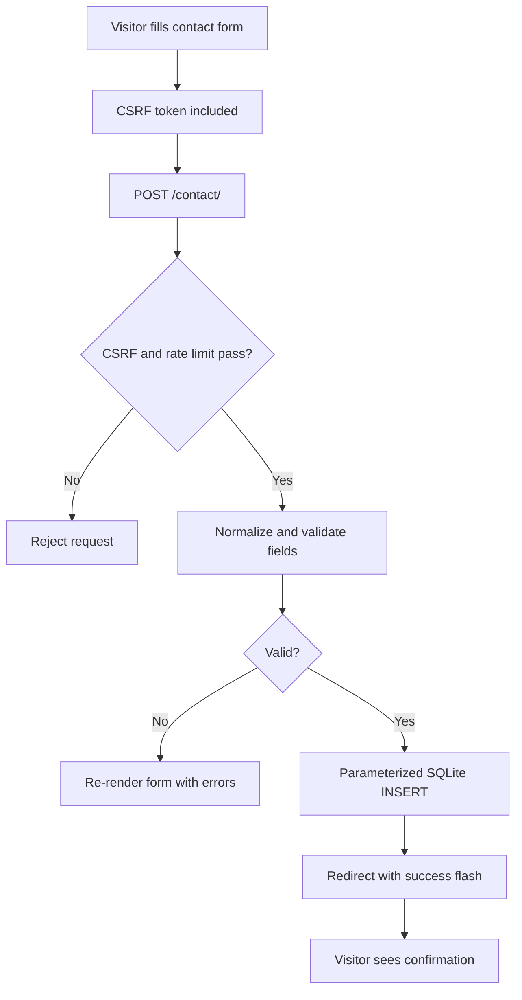

# Backend explained

## Flask architecture

Flask receives an HTTP request, chooses the matching function in `routes.py`, and returns either HTML, JSON, or a redirect. The project uses an **app factory** (`create_app`) rather than a global tangle of setup code. That makes tests and environments easier to configure.

| Component | Purpose | Why it matters | Score | Recommendation |
|---|---|---|---:|---|
| App factory | Creates/configures Flask | Enables clean tests and environment-specific settings | 8/10 | Keep this pattern |
| Blueprints | Groups main pages and API | Keeps routes understandable | 8/10 | Split admin/content routes later if added |
| Config | Reads safe environment settings | Separates secrets from code | 7/10 | Add explicit public URL and config validation |
| Validators | Normalizes and checks form fields | Prevents malformed/oversized input | 7/10 | Add stricter email/domain and Unicode policy only if business needs it |
| Security module | CSRF, headers, cookies | Reduces common web attacks | 8/10 | Add CSP reporting and central security event logging |
| Rate limiter | Persists per-IP request windows | Limits simple automated abuse across workers | 6/10 | Move to Redis/edge rate limiting when traffic grows |
| Database helper | SQLite schema and safe queries | Stores leads without string-built SQL | 6/10 | Use managed PostgreSQL for production data |
| Error handlers | Branded 404/500 views | Gives visitors a controlled experience | 6/10 | Send 500 errors to monitoring with a request ID |
| WSGI/Procfile | Starts Gunicorn on host | Correct production serving concept | 7/10 | Pin worker strategy and health check in deployment config |

## The contact-form workflow



The data is currently stored in `contact_submissions` in `instance/lexnush.sqlite3` by default (or the file supplied by `LEXNUSH_DATABASE_PATH`). It includes name, email, topic, message, and a timestamp. No email is sent, no CRM is called, and no administrator is alerted. That is the most important product workflow gap.

## Newsletter workflow

`POST /newsletter/` uses the same CSRF/rate-limiting flow. It validates an email and stores it in the `newsletter` table with a source and date. Duplicate addresses are ignored. It does **not** subscribe the person to a mailing platform, send double opt-in, provide unsubscribe management, or send a confirmation message.

## Database and data access

The database uses SQLite with parameterized queries, foreign keys, WAL mode, a busy timeout, secure-delete setting, and `trusted_schema=OFF`. There are CLI commands to initialise, back up, and purge personal data. These are very good foundations for a small local application.

To inspect submissions on a machine that has the database file, an authorised operator can run:

```sh
sqlite3 instance/lexnush.sqlite3
SELECT id, name, email, topic, message, created_at
FROM contact_submissions ORDER BY created_at DESC;
```

Do not expose this database file or a raw SQL console to the public internet. There is no customer-facing or staff-facing dashboard today, and replies must be sent manually from the captured email address.

## Sessions, cookies, and CSRF

Flask signs session cookies with `SECRET_KEY`; it does not store session rows in the database. In production, cookies are HttpOnly, Secure, and SameSite=Lax. CSRF tokens protect forms, and invalid/missing tokens are rejected. This is strong for a site with no user login.

## Error handling and logging

Visitors receive styled error pages. The server does not yet send exceptions to Sentry, a log drain, or an alerting channel; thus a real failure can be invisible to the owner. Add structured logs, error monitoring, and a daily review/alert policy before collecting leads.

## Caching and performance behaviour

The browser receives server-rendered HTML. Search is in-memory and fast at this content size. The security module sends `Cache-Control: no-store` for HTML, which protects dynamic form pages but means content pages cannot benefit from page caching. Static asset caching/compression depends on the host and is not explicitly configured here.
