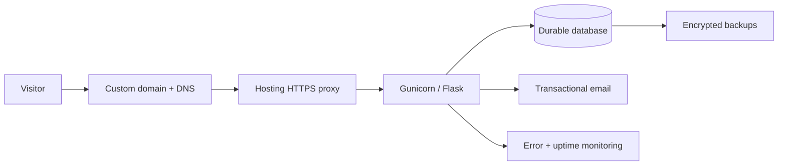

# Deployment guide

## Deployment decision

Deploy this version only as a controlled single-instance preview or low-volume launch **after** completing the production blockers in [PRODUCTION_READINESS.md](PRODUCTION_READINESS.md). Do not use an ephemeral local filesystem as the sole storage for contact data.

## Production architecture



## Current Render-relevant files

- `Procfile` starts `gunicorn wsgi:app`.
- `wsgi.py` exposes the Flask application object.
- `requirements.txt` installs Flask, Gunicorn, Talisman and Flask-WTF.
- `.env.example` documents the required variables.
- `/healthz` can be used as a health-check path.

## Required environment variables

Set these in the host dashboard or secret manager—never commit them:

```text
FLASK_ENV=production
SECRET_KEY=<unique high-entropy secret>
LEXNUSH_DATABASE_PATH=/var/data/lexnush.sqlite3
LEXNUSH_TRUSTED_HOSTS=example.com,www.example.com
TRUSTED_PROXY_COUNT=1
```

Use the actual persistent mount path supplied by the hosting provider, if retaining SQLite temporarily. `TRUSTED_PROXY_COUNT=1` is only an example; set it to the exact number of trusted reverse proxies in front of the app after confirming the provider’s network design.

## Safe first deployment sequence

1. Provision the service and a custom domain. Force a single canonical host (for example, `www` or non-`www`).
2. Provision managed PostgreSQL before real lead capture, or attach a durable disk for a temporary single-instance SQLite launch.
3. Add production environment variables and validate that startup rejects a default secret/no host list.
4. Run the app initially with one Gunicorn worker until rate limiting is moved off SQLite. Use an explicit process command such as `gunicorn --workers 1 --threads 4 --timeout 30 wsgi:app` after load testing.
5. Configure `/healthz` health checks, HTTPS, logs, alerting, and an external uptime monitor.
6. Test the real domain: homepage, every navigation link, contact/newsletter form, 404, HTTPS redirect, headers, sitemap, robots, mobile menu, and error tracking.
7. Perform and document one backup **and restore** test before accepting production data.
8. Add a transactional email notification so each contact submission reaches an owner.

## Recommended operational services

| Need | Recommendation | Why |
|---|---|---|
| Database | Managed PostgreSQL (Render, Neon, Supabase, etc.) | Durable storage, backups, access controls, multi-instance path |
| Email | Resend | Straightforward transactional email, domain authentication support, developer-friendly API |
| Error monitoring | Sentry or equivalent | Visibility into 500 errors and client failures |
| Uptime | Better Uptime/UptimeRobot or equivalent | Alerts if site/health endpoint fails |
| Edge protection | Cloudflare or host WAF | CDN, DDoS buffering, edge rate limiting, DNS controls |
| Secrets | Hosting secret manager | Keeps credentials outside repository |

SMTP can work but is more operationally fragile. SendGrid/Mailgun are capable alternatives. Google Sheets is not recommended as the primary store for contact data because it lacks application-level access control, retention, and data-model discipline. A CRM can be added once lead follow-up needs stages and team ownership; keep the database or CRM as a deliberate source of truth, not an accidental collection of copies.

## Rollback and recovery

Keep a previous deploy available, record schema changes, and test restoring a backup into a separate environment. A backup that has never been restored is only a hope, not a recovery plan.
