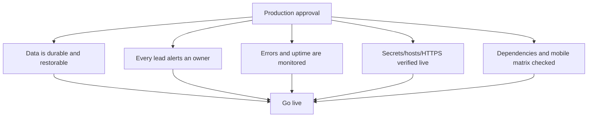

# Production readiness

> Implementation update (15 July 2026): the application now includes PostgreSQL/Alembic support, Redis-backed rate-limit configuration, a durable email outbox, Resend integration, newsletter double opt-in, protected Argon2 admin access, CI configuration, and a Render Blueprint. It still requires the real Render/Resend/Sentry credentials and live deployment verification listed in `DEPLOYMENT_CHECKLIST.md` before approval.

## Decision: NOT READY until external configuration and live verification are complete

The website can be shown as a design/demo site, but it should not yet be treated as an operated production system that accepts important inquiries. The core app is sound; the missing pieces are data operations, notification, monitoring, and verified deployment controls.

## Release gates

| Priority | Gate | Why it blocks production | Owner outcome |
|---|---|---|---|
| P0 | Durable data store and tested restore | A local/ephemeral SQLite file can lose visitor data | Managed PostgreSQL or durable disk, backups, restore evidence |
| P0 | Contact notification and triage | The owner may never know a lead arrived | Resend/email or CRM notification with tested delivery |
| P0 | Monitoring and alerting | Failures can be invisible | Error tracker, uptime check, log review/alerts |
| P0 | Dependency audit in CI | Current vulnerable packages are unverified | `pip-audit`/equivalent gate and update process |
| P1 | Privacy/consent/retention design | The site collects personal data | Privacy notice, newsletter consent/double opt-in, retention/deletion process |
| P1 | Production configuration verification | Wrong hosts/proxy/secrets can weaken security | Live checklist for HTTPS, hosts, headers, proxy count |
| P1 | Real mobile/browser test matrix | Source review is not device evidence | Automated screenshots + manual iOS/Android checks |
| P2 | Image/CDN performance work | Slow LCP harms first impression and search | Modern responsive media and compressed delivery |
| P2 | Content/operations plan | One article and a placeholder route reduce credibility | Publishing cadence and either populate/remove Conversations |

## What is already production-minded

- Application factory and blueprints
- Production-specific secret/host validation
- CSRF, headers, clickjacking protection, secure cookies
- Server-side form validation and parameterized database writes
- Database backup and personal-data purge commands
- Basic error pages, health endpoint, unit tests, mobile navigation/focus handling

## What must be true before approval

## Approval criteria

Approve only when each P0 item has an owner, evidence of a completed test, and a documented rollback/recovery path. A production deployment is a continuing responsibility, not merely a successful build command.
