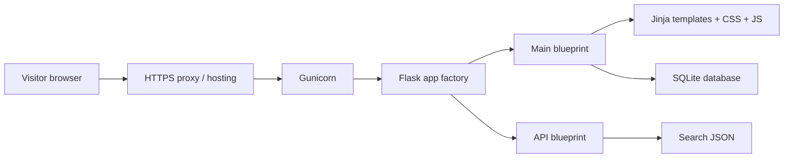

# LexNush project overview

## Executive summary

LexNush is a small Flask publication site for legal analysis.  It is a thoughtfully designed, server-rendered website with a contact form, a newsletter sign-up form, search, a SQLite database, and a solid first layer of security controls.  It is **not yet ready to operate as a production lead-capture system** because inquiries are stored locally but nobody is notified, operational monitoring is absent, and its SQLite-based deployment needs durable storage and a backup/restore process.

This report is a code and configuration audit completed on 15 July 2026. It is not a penetration test, legal-compliance opinion, or a live production-infrastructure assessment.

## What is in the repository

```text
.
├── app.py                  Development entry point
├── wsgi.py                 Production WSGI entry point
├── Procfile                Render/Gunicorn process declaration
├── requirements.txt        Python dependencies
├── .env.example            Safe configuration example
├── freeze.py               Optional static-site export helper
├── lexnush/                Flask application package
│   ├── __init__.py         App factory and CLI commands
│   ├── config.py           Development/production configuration
│   ├── routes.py           Page and API endpoints
│   ├── content.py          Editorial content data
│   ├── db.py               SQLite schema and database helpers
│   ├── validators.py       Form validation rules
│   ├── security.py         CSRF and HTTP security headers
│   └── rate_limit.py       Database-backed request limiting
├── templates/              Jinja HTML templates
├── static/                 CSS, JavaScript, logo, and images
└── tests/test_app.py       Ten automated unit/integration checks
```

## How the site starts

`app.py` imports `create_app()` from `lexnush` and creates an application for local development. `wsgi.py` imports that same application for Gunicorn, which is what the `Procfile` starts in hosting. The app factory loads configuration, enables security, opens the database when required, and registers the website and API blueprints.



## Pages and functions

| Area | Route | What it does |
|---|---|---|
| Home | `/` | Hero, featured analysis, site purpose, newsletter form |
| About | `/about/` | Brand and founder information |
| Journal | `/blogs/` | Lists editorial posts |
| Article | `/blogs/<slug>` | Renders a selected post |
| Conversations | `/interviews/` | “Coming soon” page |
| Contact | `/contact/` | Validates and stores a visitor inquiry |
| Search | `/api/search?q=…` | Searches in-memory editorial content |
| Technical SEO | `/robots.txt`, `/sitemap.xml` | Discovery instructions for crawlers |
| Operational | `/healthz` | Lightweight health response |

## How the front end and back end meet

The back end prepares data in a route, then calls `render_template()`. Jinja turns a template into HTML before it reaches the browser. Shared layout, navigation, metadata, search dialog, and footer live in `templates/base.html`; individual templates fill the `` area. CSS is split into reset, design variables, layout, components, page styles, and responsive overrides. JavaScript handles theme selection, mobile menu and search dialog behaviour, safe search-result rendering, focus management, and small visual effects.

Jinja escapes ordinary template values by default, which helps prevent HTML injection. One intentional exception is article content rendered through `|safe`; that is acceptable only while trusted developers control all content in `content.py`.

## Evidence collected

- `python3 -m unittest discover -s tests`: 10 tests passed.
- `python3 -m compileall -q app.py lexnush`: passed.
- `node --check static/script.js`: passed.
- Flask route registration was inspected; 12 application/static routes were present.
- Manual browser checks previously exercised the article page at narrow widths after the mobile rendering fix.
- `pip-audit` was not installed, so a current dependency-CVE scan was **not** completed.

For priorities and approval status, read [FINAL_SCORECARD.md](FINAL_SCORECARD.md) and [PRODUCTION_READINESS.md](PRODUCTION_READINESS.md).
