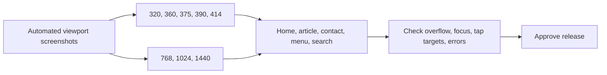

# Responsive report

## Result

The mobile rendering failure reported for the article page was addressed before this audit: the article content no longer remains hidden behind a scroll-reveal state. Manual narrow-screen browser checks confirmed rendered article content and no horizontal overflow at the tested 320/360/390 px widths. The CSS has deliberate breakpoints at desktop, tablet, and small phone sizes.

This is not a substitute for device-lab testing on actual iOS and Android hardware. The table below combines source review with the narrow-screen checks completed during the implementation session.

| Viewport | Expected layout behaviour | Audit result / watch item |
|---:|---|---|
| 320 px | Single column, compact navigation, readable article | No horizontal overflow observed on article; test actual browser font rendering before release |
| 360 px | Typical Android phone | Article content rendered; confirm touch behaviour on hardware |
| 375 px | Typical iPhone width | Responsive rules appear appropriate; needs final visual regression check |
| 390 px | Modern phone | Article title cleared fixed navigation and content rendered |
| 414 px | Large phone | CSS should retain one-column layout; final device check pending |
| 768 px | Tablet portrait | Tablet breakpoint should expand spacing/grid carefully; final visual check pending |
| 1024 px | Tablet landscape/small laptop | Desktop navigation/grid transition needs final visual check |
| 1440 px | Desktop | Wide editorial layout supported; ensure text line length remains constrained |

## What works well

- Mobile menu exists rather than compressing every desktop link.
- CSS contains targeted breakpoints down to 390 px.
- Images have declared dimensions where most important, reducing layout shifting.
- Form controls and navigation use spacious styling suitable for touch.
- Global `prefers-reduced-motion` support avoids unnecessary motion for many users.

## Risks and issues

1. `overflow-x: hidden` on the page can conceal an accidental layout overflow rather than fixing its source. Keep visual regression tests so new content does not silently clip.
2. The fixed navigation is tall on small screens. Long titles, browser chrome changes, and zoom must remain tested.
3. Large hero and portrait assets are expensive on cellular networks, even though layout is responsive.
4. Floating controls in the lower-right may overlap each other or obscure content on small screens.
5. The remaining five target widths need a repeatable automated Playwright/Cypress visual run before production approval.

## Test plan for release

## Responsive score: 78/100

The design is clearly responsive and the known blank-article mobile issue is resolved. The score is held below 85 because the complete requested viewport/device matrix has not yet been automated or run on real devices, and asset weight affects mobile usability.
