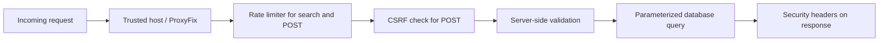

# Security audit

> Implementation update (15 July 2026): source changes now add PostgreSQL-ready migrations, Redis rate limiting, Argon2 admin login, email outbox handling, signed expiring newsletter tokens, optional Turnstile, Sentry configuration, PII-redacting logs, and CI security scans. The live environment has not been configured or penetrated, so deployment verification remains mandatory.

## Scope and conclusion

This is a source-code and local configuration review against common OWASP risks. It is not a penetration test or a guarantee of security. The project has a notably better security baseline than a typical small Flask brochure site, but operational controls and data-handling maturity are incomplete.

## Scorecard

| Category | Score | Risk | Evidence and recommendation |
|---|---:|---|---|
| SQL injection | 8/10 | Low | Writes use parameterized SQLite queries. Keep SQL parameterized; never concatenate user input into SQL. |
| Cross-site scripting | 6.5/10 | Medium | Jinja escapes normal fields; search uses `textContent`; CSP is present. `post.content \| safe` becomes high risk if content ever comes from a CMS/user. Sanitize stored rich HTML or use Markdown rendering with an allowlist. |
| CSRF | 8/10 | Low | Forms use Flask-WTF or fallback CSRF protection. Keep tokens on every state-changing request. |
| Clickjacking | 9/10 | Low | `frame-ancestors 'none'` and `X-Frame-Options: DENY` are set. |
| Cookies/sessions | 8/10 | Low | Production cookies are Secure, HttpOnly, SameSite=Lax. Use a high-entropy unique production secret. |
| Input validation | 7/10 | Medium | Server-side limits, normalization, email checks, and length rules exist. Add anti-spam honeypot/Turnstile if abuse begins. |
| Rate limiting | 6/10 | Medium | Database-backed per-IP windows work across processes, but every limited request writes SQLite and there is no edge/WAF limit. Move to CDN/Redis for scale. |
| Security headers | 8/10 | Low | CSP, HSTS in production, Referrer-Policy, permissions, MIME sniffing protection, COOP/CORP are present. Add reporting and review third-party origins periodically. |
| HTTPS/proxy trust | 7/10 | Medium | HTTPS is enforced in production through Talisman. Set `TRUSTED_PROXY_COUNT` exactly to hosting topology; an incorrect number can trust spoofed forwarded IPs. |
| Secrets/configuration | 7/10 | Medium | Production refuses default secret/no hosts. Use host secret manager, rotation procedure, and CI secret scanning. |
| Sensitive data | 4/10 | High | Contact data is plaintext in a local SQLite file with no retention job, encryption-at-rest policy, or formal access process. Use managed database, backups, retention and access control. |
| Authentication/admin | 5/10 | Medium | No login surface means no password risk, but no secure operational/admin interface exists. Add role-based staff access before creating one. |
| Email security | 2/10 | High product risk | No messages are sent or received; leads can be missed. Use a verified transactional provider and domain authentication. |
| File uploads | N/A | N/A | No upload endpoint exists. Keep it that way until secure scanning/storage is designed. |
| Dependency supply chain | 4/10 | Medium | Versions are partly pinned, but no lock hashes, automated audit, or dependency update automation. `pip-audit` was unavailable locally, so current CVEs are unverified. |
| Monitoring/incident response | 3/10 | High | No central logs, alerts, Sentry, WAF telemetry, or response playbook. |

## Existing protection flow

## Specific findings

### High priority

1. **Personal data lacks production operations.** Contact details are stored locally, but there is no monitored notification, retention schedule, access review, or tested restore. Use managed PostgreSQL, encrypted backups, a defined retention period, and an owner notification.
2. **No dependency-vulnerability gate.** Install `pip-audit` in CI, use a locked dependency set or hashes, and enable automated update PRs. A missing scanner is not evidence that dependencies are safe.
3. **No production error visibility.** Add Sentry (or equivalent), structured logs without sensitive message bodies, uptime monitoring, and an incident owner.

### Medium priority

1. Treat `post.content | safe` as trusted-code-only. Before editors or a CMS can write HTML, sanitize it with a strict allowlist or store safe Markdown.
2. Put rate limiting at the CDN/WAF and use Redis instead of SQLite when multiple application workers/instances are needed.
3. Add a privacy notice, consent copy for newsletter, double opt-in, unsubscribe handling, and retention/deletion process appropriate to the jurisdictions served.
4. Verify actual production `TRUSTED_PROXY_COUNT`, host allowlist, HTTPS redirects, HSTS, and environment secrets after deployment.

### Low priority

Add CSP reporting, a `Permissions-Policy` review cadence, security event logs, secret rotation documentation, and a simple security test checklist in CI.

## OWASP-style hardening checklist

- [x] No known dynamic SQL construction in application code
- [x] Server-side validation and CSRF protection
- [x] Strict framing policy and modern security headers
- [x] Production cookie protections configured
- [x] Debug disabled in production configuration
- [ ] Automated dependency scan and lock/hashes
- [ ] Centralized logs, monitoring, alerting, incident playbook
- [ ] Durable/encrypted data store and tested restoration
- [ ] Email/CRM workflow, consent, privacy and retention controls
- [ ] Staff authentication/authorization if an admin area is introduced

**Security verdict:** good application-level foundations; not yet a fully operated production security posture.
