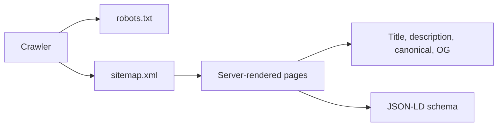

# SEO report

## Summary

The server-side rendered architecture is SEO-friendly. Pages have titles, descriptions, canonical URLs, Open Graph/Twitter metadata, robots instructions, sitemap output, semantic sectioning, and JSON-LD. The remaining work is content depth, stable production URL configuration, and search-engine verification.

| Area | Score | Findings |
|---|---:|---|
| Page titles/descriptions | 8/10 | Metadata is generated per page; review uniqueness as articles grow. |
| Canonical URLs | 7/10 | Canonical uses `request.base_url`, which removes query strings. Set an explicit public URL to avoid host-derived mistakes. |
| Open Graph/Twitter | 8/10 | Social metadata is present in the base template. Verify preview images/absolute URLs on live domain. |
| Robots/sitemap | 7/10 | Both routes exist. Add `lastmod` values and submit sitemap to Search Console. |
| Structured data | 8/10 | Website, Organization, BreadcrumbList, and Article JSON-LD are included. Validate with Google’s Rich Results Test after launch. |
| Headings/semantics | 8/10 | Editorial pages use useful hierarchy. Maintain one clear H1 per route. |
| Internal linking | 6/10 | Primary navigation is sound, but there is little content and no related-article system. |
| Content authority | 5/10 | One post and a placeholder interviews page limit topical authority and crawl depth. |
| Technical discovery | 7/10 | Server render works well; live redirect, status codes, and XML output still need production validation. |

## Existing SEO flow

## Recommendations

1. Set and validate one canonical public domain in production. Redirect the alternate `www` or non-`www` domain consistently.
2. Add article publishing dates, modified dates, authorship detail, related articles, and `lastmod` in sitemap entries.
3. Publish a substantive editorial calendar before relying on organic traffic. Content—not markup—is the main SEO limit.
4. Register the live property in Google Search Console and Bing Webmaster Tools, submit the sitemap, and review index coverage.
5. Compress the hero image and ensure social share previews use an intentional 1200×630 image.

## SEO score: 76/100

Technically solid for a small launch; not yet content-mature enough for strong organic competition.
